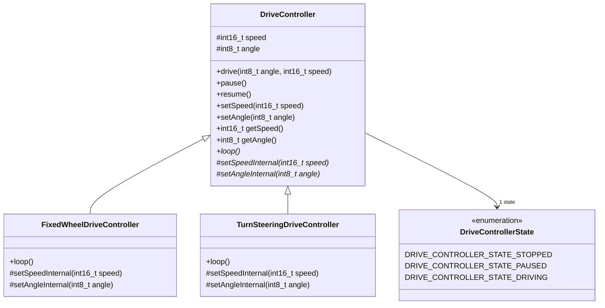

# New Motor Driver (Hardware abstraction libarary)
Library to abstract away the interaction with the hardware of the car and unify utilization between different car types.
## Class diagram
### Simplified (Functional block diagram)

### Full class diagrm
