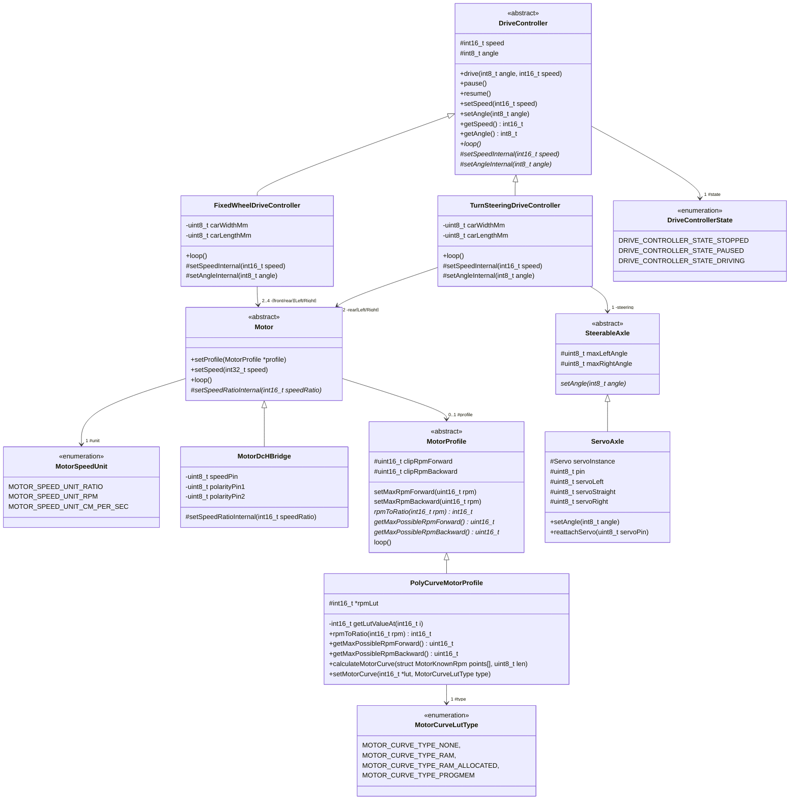
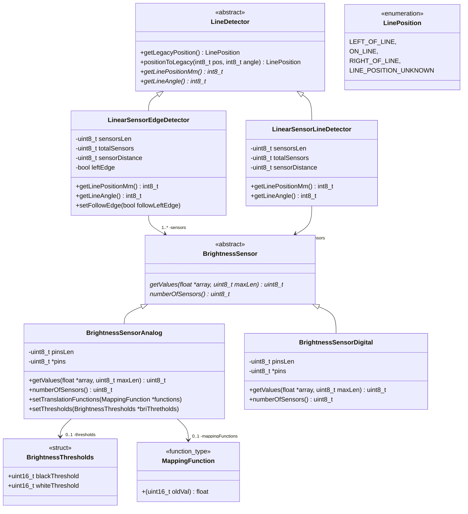
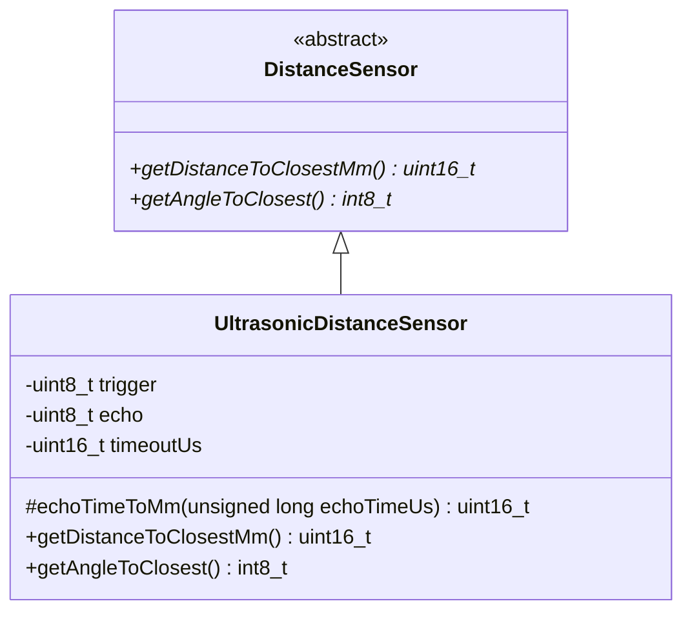

# New Motor Driver (Hardware abstraction libarary)
Library to abstract away the interaction with the hardware of the car and unify utilization between different car types.

## Installation
[Download this repository as ZIP file](https://github.com/SQA-Robo-Lab/Sofdcar-HAL/archive/refs/heads/main.zip) and install it in your Arduino IDE via `Sketch -> Include library -> Add .ZIP library`

## Class diagram
### Simplified (Functional block diagram)

### Full class diagrm
#### Driving hardware abstraction

#### Line/Lane detection hardware abstraction

#### Distance/Other vehicle/obstacle hardware abstraction
